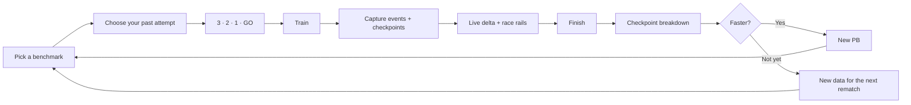
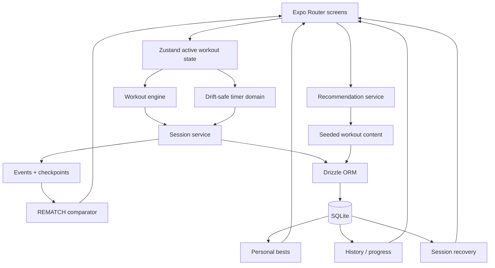

<p align="center">
  
</p>

<p align="center">
  <strong>A benchmark fitness app where your past performance becomes a live opponent.</strong><br/>
  Race real checkpoint telemetry, find where you gained or lost time, and build the next version of yourself.
</p>

<p align="center">
  
  
  
  
  <a href="./LICENSE"></a>
</p>

<p align="center">
  <a href="#the-idea">The idea</a> ·
  <a href="#how-rematch-works">How it works</a> ·
  <a href="#what-makes-it-different">Why REMATCH</a> ·
  <a href="#architecture">Architecture</a> ·
  <a href="#quick-start">Quick start</a>
</p>

---

## The idea

Most workout apps record a result.

**REMATCH records a race.**

Every completed benchmark can become an opponent for the next attempt. Instead of comparing only final times, REMATCH stores workout events and checkpoint timestamps, then uses that real telemetry during the next session to show whether you're ahead or behind **where it actually matters**.

> Final time tells you **if** you improved. Checkpoints help tell you **where**.

No social leaderboard. No stranger to chase. No backend required for the core training loop.

**You vs. you.**

<table>
  <tr>
    <td align="center"><strong>31</strong><br/>original benchmarks</td>
    <td align="center"><strong>52</strong><br/>exercises</td>
    <td align="center"><strong>5</strong><br/>workout formats</td>
    <td align="center"><strong>4</strong><br/>distance variants</td>
  </tr>
</table>

## How REMATCH works



A previous attempt is not simulated as a smooth, imaginary pace. The race UI advances from **recorded checkpoint telemetry**. That keeps the comparison grounded in what actually happened during that workout.

## What makes it different

| | Capability | What it means in practice |
|---|---|---|
| **↯** | **Real rematch telemetry** | Live ahead/behind comparison is based on recorded checkpoints, not linear interpolation. |
| **◎** | **Any past attempt can race you** | Historical completed sessions are selectable as opponents, so “past you” is a concrete performance. |
| **◆** | **PBs stay comparable** | Personal bests are isolated by workout version, workout variant, and scaling category. |
| **↺** | **Workout recovery** | Active and paused sessions persist their state and can be resumed after leaving the workout flow. |
| **⌁** | **Offline-first core** | Workouts, sessions, events, checkpoints, results, feedback, and PBs live in local SQLite. |
| **⚡** | **Challenge Me** | Pick 5, 10, 15, 20, or 30 minutes and the recommendation engine chooses a suitable benchmark. |
| **◫** | **Progress, not just history** | Results can be compared across attempts to surface improvement from first to latest performance. |
| **✦** | **Workout-native UX** | Haptics, keep-awake behavior, large touch targets, countdowns, rep controls, and pause/resume are built around training. |

## Training library

REMATCH ships with **31 original benchmark workouts** — including **TEMPEST, EMBER, RIPTIDE, AVALANCHE, SUMMIT, VORTEX, APEX, NOVA, ONYX, AURORA** and more.

The current seed contains **52 exercises** with movement metadata and scaling relationships.

### Workout model

- **Formats:** fixed rounds, chipper, ladder, intervals, AMRAP
- **Difficulty:** beginner, intermediate, advanced, elite
- **Scaling:** RX, scaled, modified
- **Variants:** full, ¾, ½, ¼
- **Equipment-aware recommendations**
- **Versioned workout definitions** so historical results stay meaningful when a benchmark changes

The recommendation layer can filter by available time, level, equipment, recent workouts, and recovery constraints before selecting a benchmark.

## The race engine

The core domain is deliberately small and deterministic.

A workout session tracks:

```text
session
├── version + variant + scaling
├── timer state
├── current round / exercise / reps
├── event stream
├── checkpoint timestamps
├── opponent session
└── persisted recovery state
```

During a rematch, the comparator lines up matching checkpoint keys from the current and opponent sessions:

```text
Round 1    you 02:03    past you 02:08    -00:05
Round 2    you 04:21    past you 04:17    +00:04
Round 3    you 06:30    past you 06:42    -00:12
```

Negative delta means you're ahead. Positive delta means the old you is making you work for it.

## Architecture



### Design principles

**Local first.** The important path from tapping **START** to finishing a workout does not depend on a remote service.

**History must stay honest.** Workout versions, variants, and scaling are part of result compatibility instead of being flattened into one misleading PB.

**The timer is part of the domain.** Pauses are accumulated explicitly so elapsed active time stays stable across pause/resume cycles.

**Workout controls beat decoration.** The active screen keeps high-priority actions in reach with large touch targets and avoids blocking animation.

## Product flow

| Surface | Purpose |
|---|---|
| **Onboarding** | Goal, level, available equipment, typical workout time, weekly frequency |
| **Today** | Recommended session and fast entry into the next challenge |
| **Challenge Me** | Time-boxed recommendation: 5 / 10 / 15 / 20 / 30 minutes |
| **Library** | Browse the benchmark catalog |
| **Workout** | Structure, variant, scaling, opponent, and start |
| **Active** | Timer, reps, exercise visual, race delta, progress rails |
| **Results** | Final comparison, checkpoint breakdown, PB state, workout feedback |
| **Progress** | Attempts and first → latest performance trend |
| **Profile** | Training preferences and workout behavior settings |

## Tech stack

| Layer | Technology |
|---|---|
| App | React Native 0.86 + React 19 |
| Runtime | Expo 57 |
| Navigation | Expo Router |
| Language | TypeScript 6 |
| State | Zustand |
| Persistence | Expo SQLite |
| ORM | Drizzle ORM |
| Motion | React Native Reanimated |
| Input | React Native Gesture Handler |
| Feedback | Expo Haptics |
| Typography | Bebas Neue + DM Sans |
| Tests | Node test runner via `tsx` |

## Quick start

### 1. Install

```bash
git clone https://github.com/sdziupin/Rematch.git
cd Rematch
npm ci
```

### 2. Run

```bash
npm start
```

Then press:

- `i` — iOS simulator
- `a` — Android emulator
- `w` — web

Or use the dedicated scripts:

```bash
npm run ios
npm run android
npm run web
```

