<p align="center">
  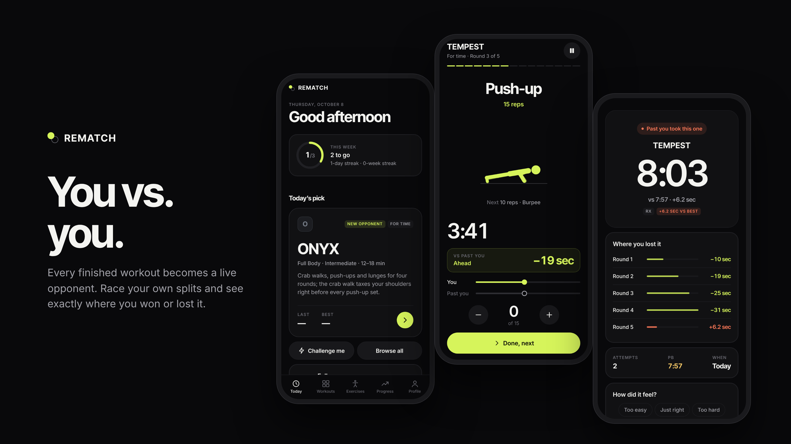
</p>

<h1 align="center">REMATCH</h1>

<p align="center">
  Benchmark workouts where your last attempt is the opponent.<br/>
  Race your own recorded splits and see exactly where you won or lost it.<br/>
  iOS, Android and the web. Offline, no account.
</p>

<p align="center">
  
  
  
  
  <a href="./LICENSE"></a>
</p>

---

## The idea

Most workout apps record a result. REMATCH records a race.

Every movement and every round of a benchmark is a checkpoint. The next time you do that workout, your previous attempt runs alongside you on those same checkpoints, so you know whether you're ahead or behind while it still matters, not just at the end.

There's no leaderboard and no stranger to chase. Just you and the last version of you.

## Screens

<table>
  <tr>
    <td width="25%">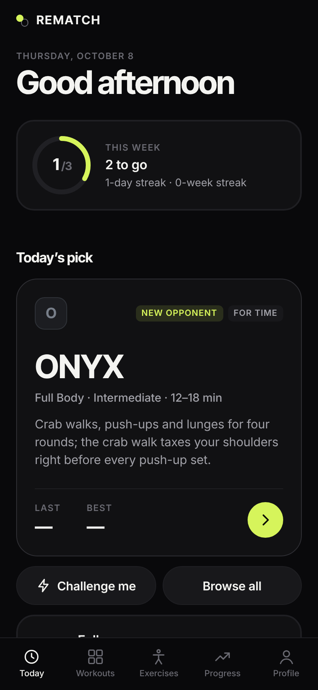</td>
    <td width="25%">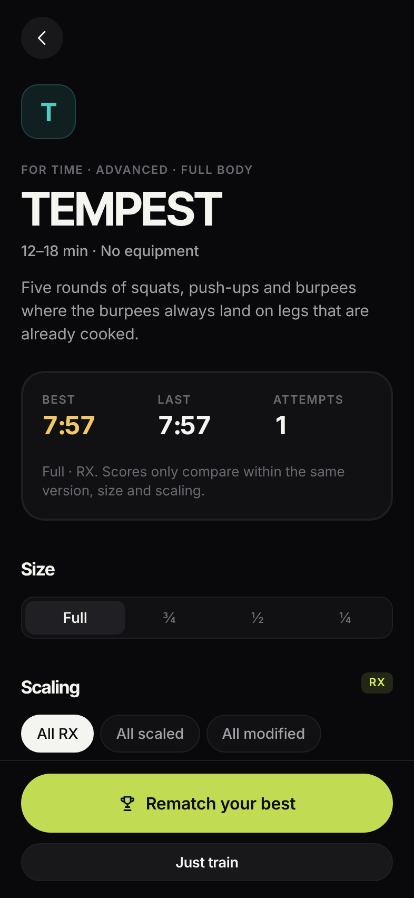</td>
    <td width="25%">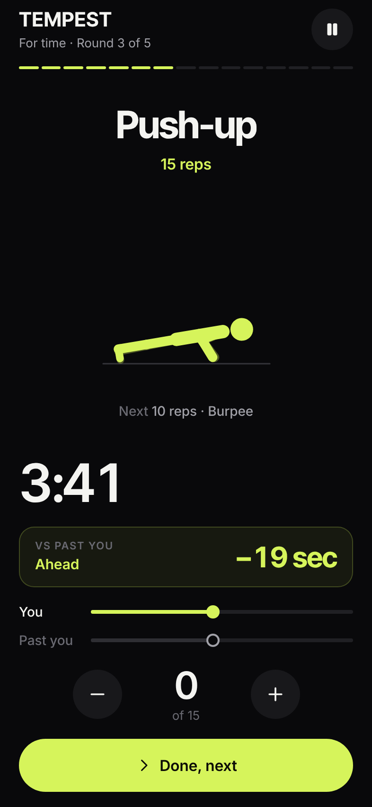</td>
    <td width="25%">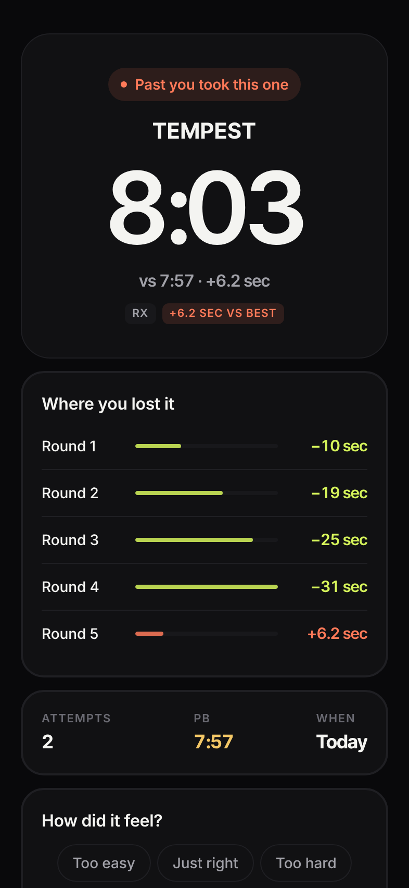</td>
  </tr>
  <tr>
    <td align="center"><sub><b>Today</b><br/>Weekly goal, today's pick, recent bests</sub></td>
    <td align="center"><sub><b>Workout</b><br/>Size, scaling, history, opponent</sub></td>
    <td align="center"><sub><b>Live rematch</b><br/>Delta and race lanes from real splits</sub></td>
    <td align="center"><sub><b>Result</b><br/>Where you won or lost it</sub></td>
  </tr>
  <tr>
    <td>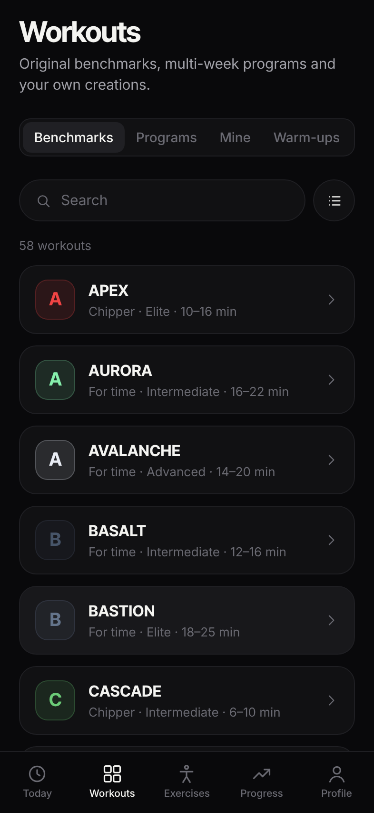</td>
    <td>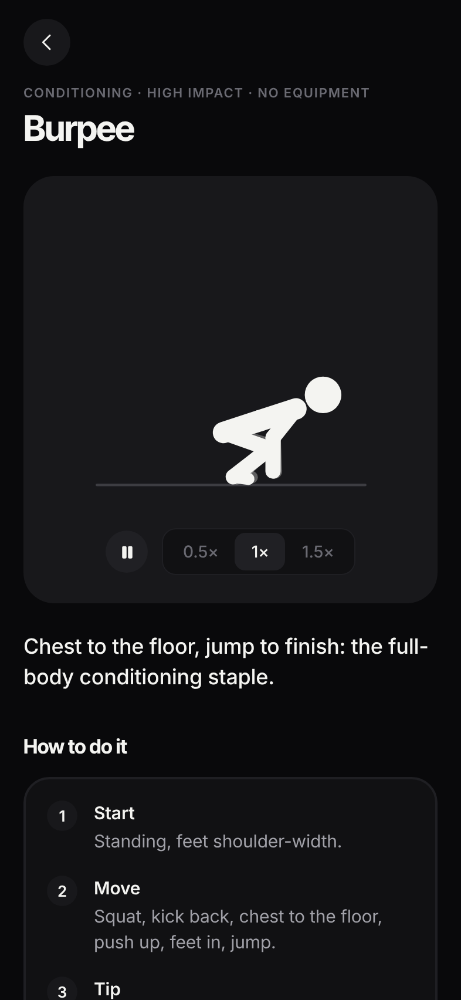</td>
    <td>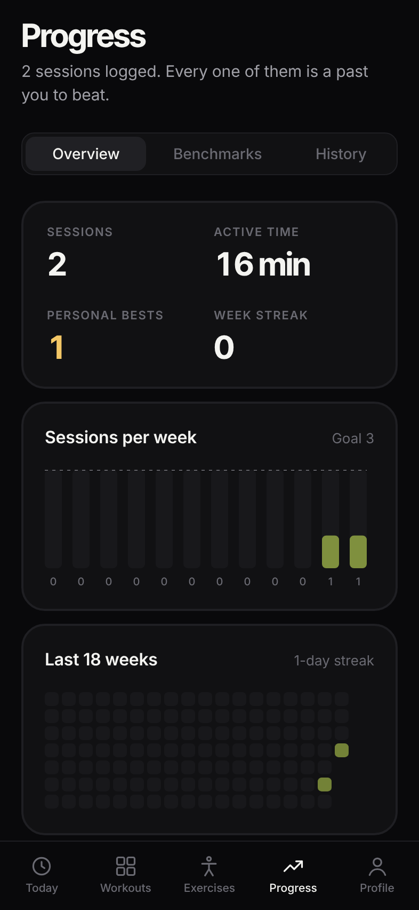</td>
    <td>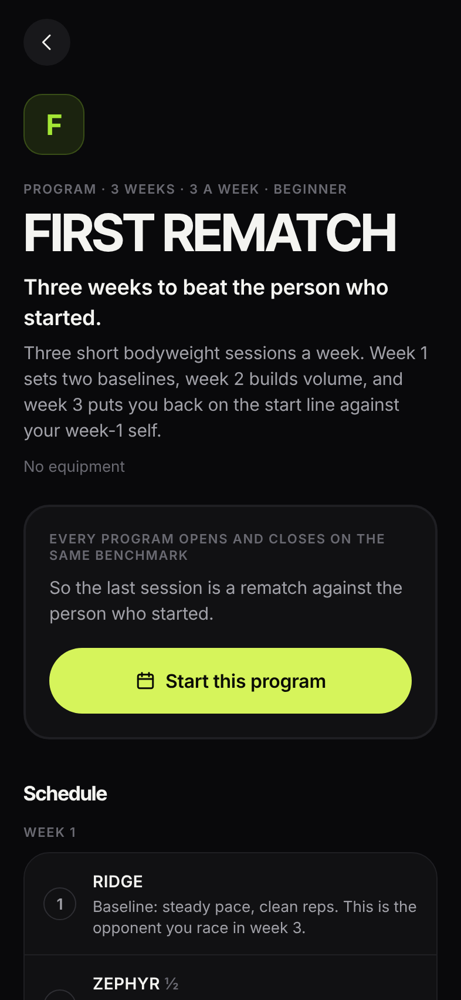</td>
  </tr>
  <tr>
    <td align="center"><sub><b>Workouts</b><br/>58 benchmarks, programs, your own</sub></td>
    <td align="center"><sub><b>Exercises</b><br/>95 animated demos with cues</sub></td>
    <td align="center"><sub><b>Progress</b><br/>Totals, calendar, muscle map</sub></td>
    <td align="center"><sub><b>Programs</b><br/>Multi-week plans that re-test</sub></td>
  </tr>
</table>

On wide screens the tab bar becomes a sidebar and every screen gets a two-column layout:

<p align="center">
  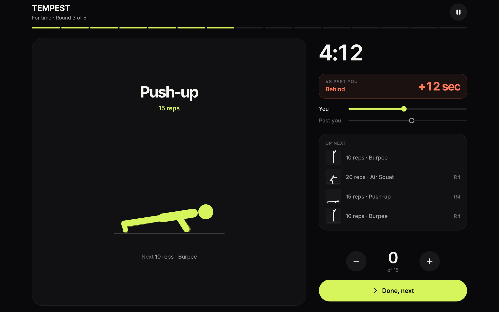
  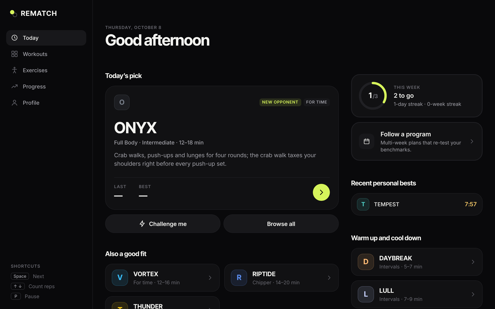
</p>
<p align="center">
  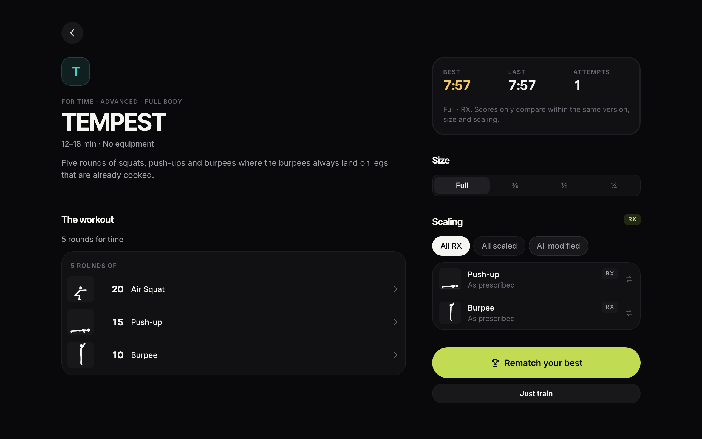
  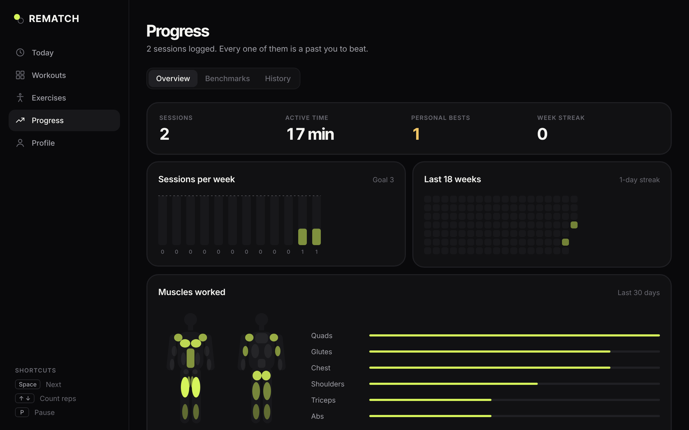
</p>

## What's inside

| | |
|---|---|
| **Checkpoint racing** | A split at every movement and round. The live delta compares you at the same checkpoint and flips the moment past-you reaches your next one first. |
| **Any opponent** | Race your best, your last attempt, or any finished attempt. |
| **Honest personal bests** | Kept separately for each workout version, size (full, ¾, ½, ¼) and scaling (RX, scaled, modified). Editing a workout creates a new version, so old results stay comparable. |
| **Every format** | For time, chippers, ladders, AMRAP, EMOM, intervals, time caps and prescribed rest. Timed holds and rests run their own clocks. |
| **Scaling** | Swap any movement for its easier variant before or during a workout. The result is filed as scaled or modified automatically. |
| **Exercise library** | 95 movements, each with an original animated demo, coaching cues, common mistakes, a muscle map and easier or harder progressions. |
| **Programs** | Six multi-week plans. Each opens and closes on the same benchmark, so the last session is a rematch against the person who started. |
| **Builder** | Make your own benchmarks in any format. They race, version and track bests like the built-in ones. |
| **Progress** | Weekly goal and streaks, an 18-week calendar, a 30-day muscle map, first, latest and best for every benchmark, and full history. |
| **Built for training** | Countdown beeps that mix with your music, an optional voice coach, haptics, keep-awake, big touch targets, pause and resume. |
| **Web app** | Responsive layout, keyboard shortcuts, installable as a PWA, works offline after the first visit. |
| **Your data** | Sessions survive app kills and reloads. Export everything as one JSON file and restore it anywhere. |

## Content

**58 original benchmarks** (TEMPEST, EMBER, RIPTIDE, AVALANCHE, SUMMIT, VORTEX, ONYX and more), **4 warm-ups**, **3 cool-downs** and **6 programs**.

| Format | Benchmarks | Scored by |
|---|---:|---|
| For time | 30 | time |
| Chipper | 6 | time |
| Ladder | 3 | time |
| Intervals | 10 | total reps |
| AMRAP | 5 | rounds + reps |
| EMOM | 4 | total reps |

Workouts are tagged by equipment (bodyweight, mat, pull-up bar, dumbbells, kettlebell, bench or box, jump rope, resistance band) and level (beginner to elite), so recommendations only suggest what you can actually do.

| Program | Length |
|---|---|
| FIRST REMATCH | 3 weeks, 3 sessions a week |
| ENGINE | 4 weeks, 3 sessions a week |
| MIDLINE | 3 weeks, 3 sessions a week |
| LOADED | 4 weeks, 3 sessions a week (dumbbells) |
| ASCENT | 4 weeks, 3 sessions a week (pull-up bar) |
| GAUNTLET | 4 weeks, 4 sessions a week |

## Design

REMATCH is dark, quiet and precise. The interface stays out of the way so the clock and the delta can do the talking.

| Token | Value | Role |
|---|---|---|
| `background` | `#09090B` | Canvas |
| `surface` / `surfaceRaised` | `#111113` / `#18181B` | Cards, controls |
| `border` | `#1F1F23` | Hairlines |
| `text` / `textSecondary` / `textMuted` | `#F4F4F1` / `#A1A1A8` / `#6A6A72` | Type |
| `accent` | `#D6F45B` | The one signal colour: primary actions, "you", ahead |
| `behind` | `#FF7A59` | Behind, lost time |
| `pb` | `#F3C766` | Personal bests |
| `rest` | `#8BA8FF` | Rest periods |

- **Type.** Inter Tight for names and numbers, Inter for everything else. All figures are tabular so clocks and splits never jitter.
- **One accent.** Selected chips invert to white instead of turning green, which keeps the signal colour for actions and race state.
- **No emoji.** Each workout gets its own colour and a monogram, so it looks the same on every platform.
- **The mark.** A solid disc (you) just ahead of an outlined one (past you). `npm run generate:icons` renders it into every app and web icon.

Tokens live in [`src/theme`](./src/theme), and every screen builds on the kit in [`src/components/ui.tsx`](./src/components/ui.tsx).

## How the race works

The workout engine ([`src/engine/workoutEngine.ts`](./src/engine/workoutEngine.ts)) is a pure, deterministic state machine. Every transition takes elapsed **active** time and returns the next state plus the events it produced. Timed transitions land on their exact boundary, not on the tick that noticed them, so a late timer or a backgrounded phone never stretches an interval.

```text
session
├── version + size + scaling
├── timer (pauses never count)
├── round / movement / reps, rest, EMOM window, time cap
├── checkpoints: r{round}-e{movement}, round-{n}  (+ cumulative reps)
├── event log
└── opponent session
```

There are two kinds of race:

- **Pace** (for time, AMRAP): who reached each checkpoint first.
  ```text
  Round 1    you 02:03    past you 02:08    −5.0 sec
  Round 2    you 04:21    past you 04:17    +4.0 sec
  ```
- **Volume** (intervals, EMOM): the clock is fixed, so the race compares reps banked at the same checkpoint.

The opponent never moves at a smooth, invented pace. The race UI only moves on recorded checkpoint telemetry.

## Architecture

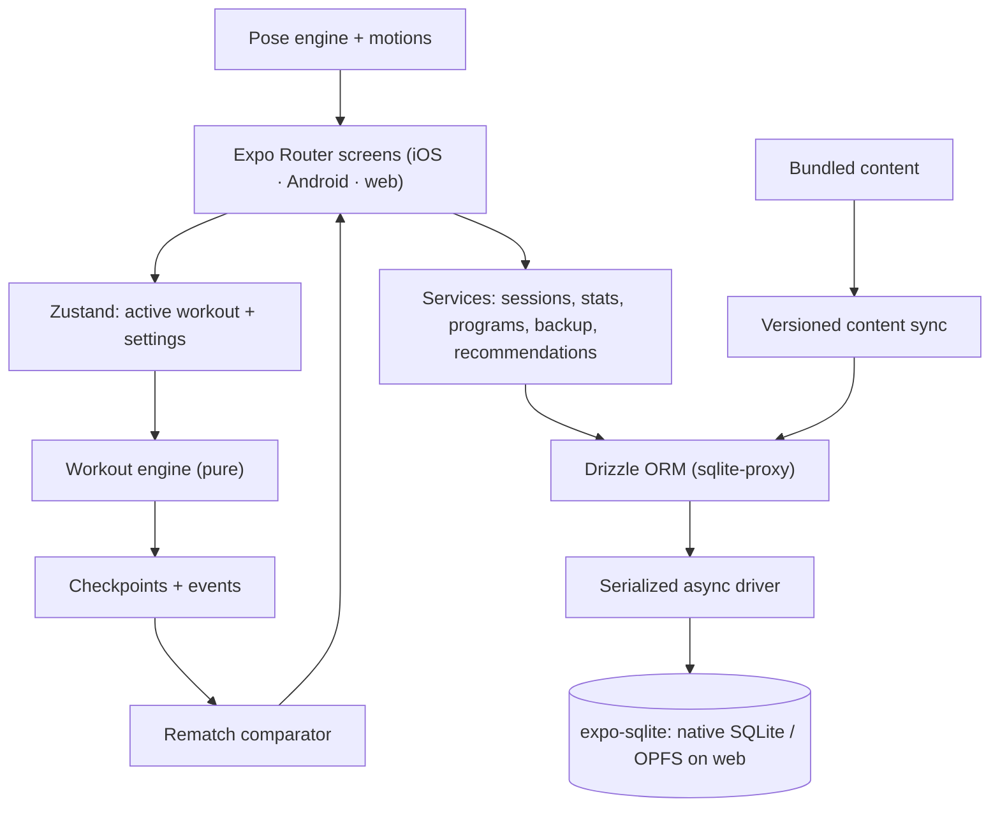

- **Local first.** Nothing between Start and Finish depends on a network.
- **History stays honest.** A workout's identity is its exact structure and scoring. A structural change creates a new version; old results keep their own bests.
- **The timer is domain logic.** Pauses are accumulated explicitly and every transition is computed from active time.
- **Async everywhere.** Drizzle runs through `sqlite-proxy` on expo-sqlite's async API (the sync API busy-waits on the web). All statements share one serialized queue, and transactions hold it.
- **Content reaches existing installs.** On start, bundled content is diffed against the database: new workouts are added, metadata refreshed, changed workouts versioned.

### Stack

React Native 0.86 and React 19 on Expo SDK 57, Expo Router, TypeScript 6, Zustand, expo-sqlite with Drizzle ORM, react-native-svg for animations and charts, expo-audio, expo-speech, expo-haptics and expo-keep-awake for cues. Tests run on Node's test runner via `tsx` against real SQLite (`node:sqlite`).

## Getting started

```bash
git clone https://github.com/sdziupin/Rematch.git
cd Rematch
npm ci

npm start          # then press i (iOS), a (Android) or w (web)
npm run web        # straight to the browser
```

### Web build

```bash
npm run build:web  # static export to dist/
npm run serve:web  # http://localhost:8080 with SPA fallback
```

`dist/` works on any static host with a fallback to `index.html`. Serve it from the domain root so `/sw.js` can cache it for offline use. Data lives in the browser's origin-private file system and can be open in one tab at a time; a second tab offers to take over.

### Checks

```bash
npm test           # 365 tests: engine, race, scoring, stats, DB lifecycle, migrations, backup, content, animations
npm run typecheck
```

### Scripts

| Command | What it does |
|---|---|
| `npm run screenshots` | Races TEMPEST twice in a fresh browser and captures every screen in `docs/screenshots/` (needs `serve:web` running) |
| `npm run generate:icons` | Renders the brand mark into the app, splash, adaptive and web icons |
| `npm run generate:sounds` | Re-synthesises the cue sounds in `assets/sounds/` |
| `npm run motion-sheet -- out.html --only burpee,pull-up` | Renders exercise animations as a contact sheet |

Both Playwright scripts accept `CHROMIUM_PATH` to use an existing Chromium.

### Keyboard (web)

| Key | During a workout |
|---|---|
| `Space` / `Enter` | Next movement · skip rest · resume |
| `↑` `+` / `↓` `−` | Count reps |
| `P` / `Esc` | Pause or resume |

## Project structure

```text
app/                 Expo Router screens
  (tabs)/            Today, Workouts, Exercises, Progress, Profile
  workout/           Detail, live workout, recovery, result
  exercise/ program/ opponent/  builder.tsx  challenge.tsx  onboarding.tsx
src/
  animation/         Skeleton and pose solver, motions for every exercise
  components/        UI kit, charts, race UI, dialogs, wordmark
  content/           Exercises, workouts, programs (+ validation tests)
  db/                Schema, migrations, async driver, content sync
  domain/            Timer, rematch comparator, scoring, stats, scaling
  engine/            Deterministic workout state machine
  services/          Sessions, stats, programs, backup, cues, recommendations
  store/             Zustand stores
  theme/             Colour, type and spacing tokens
public/              Web shell: manifest, icons, service worker
assets/              App icons and cue sounds
docs/screenshots/    README images (generated)
scripts/             Web server, screenshots, icons, sounds, motion sheet
```

## Guarantees

Enforced by tests:

- Paused time never leaks into active time.
- Timed steps, rests and EMOM windows end on their exact boundaries.
- Race comparison uses checkpoint telemetry, ordered by position in the workout.
- RX and scaled results never share a best, and a session can only move down the scaling ladder.
- Abandoned or time-capped attempts never set a best; deleting a best promotes the next one.
- Existing installs upgrade in place without losing bests.
- A backup restores onto any install, even one that numbered workout versions differently.
- The 31 original workout structures never change (snapshot test).

## Acknowledgements

Several feature ideas (exercise library with demos, body map, programs, rest timer, heatmap, backup export, keyboard-driven web UI) were inspired by [openGym](https://github.com/DuarteSantos8/openGym). No code, data or media was copied. REMATCH's animations, sounds, content and code are original.

## License

[MIT](./LICENSE)

<br/>

<p align="center">
  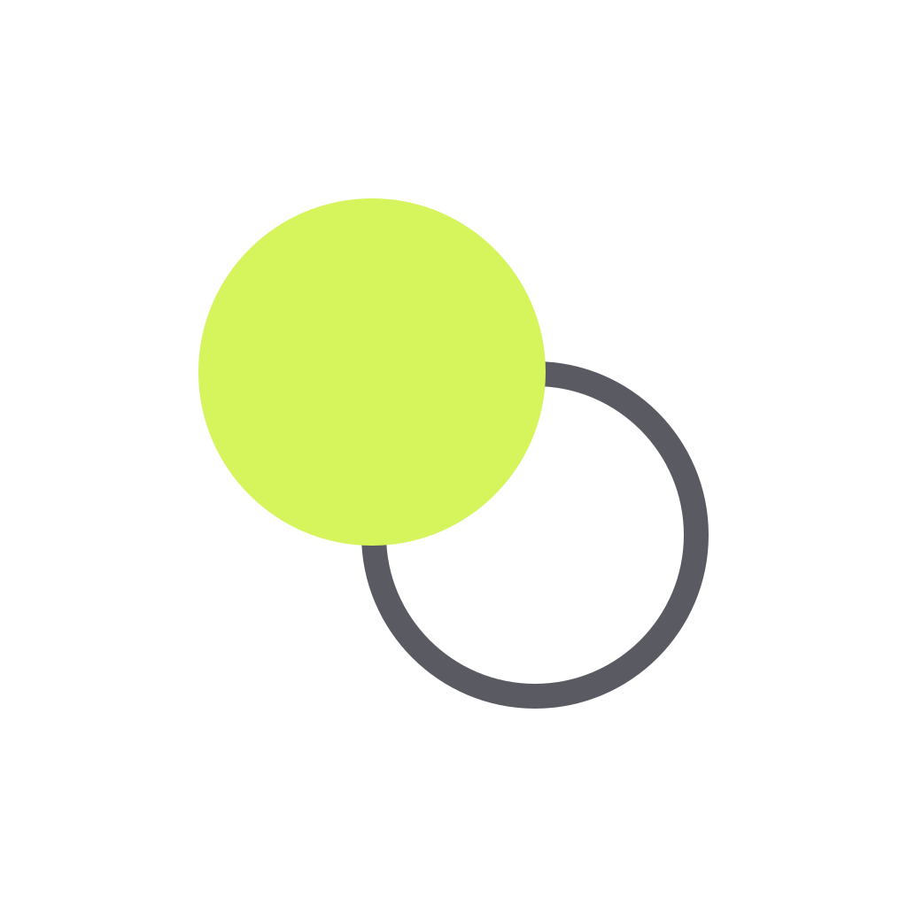<br/>
  <sub>Your best competition already knows all your excuses.</sub>
</p>
