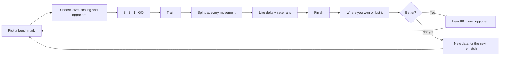
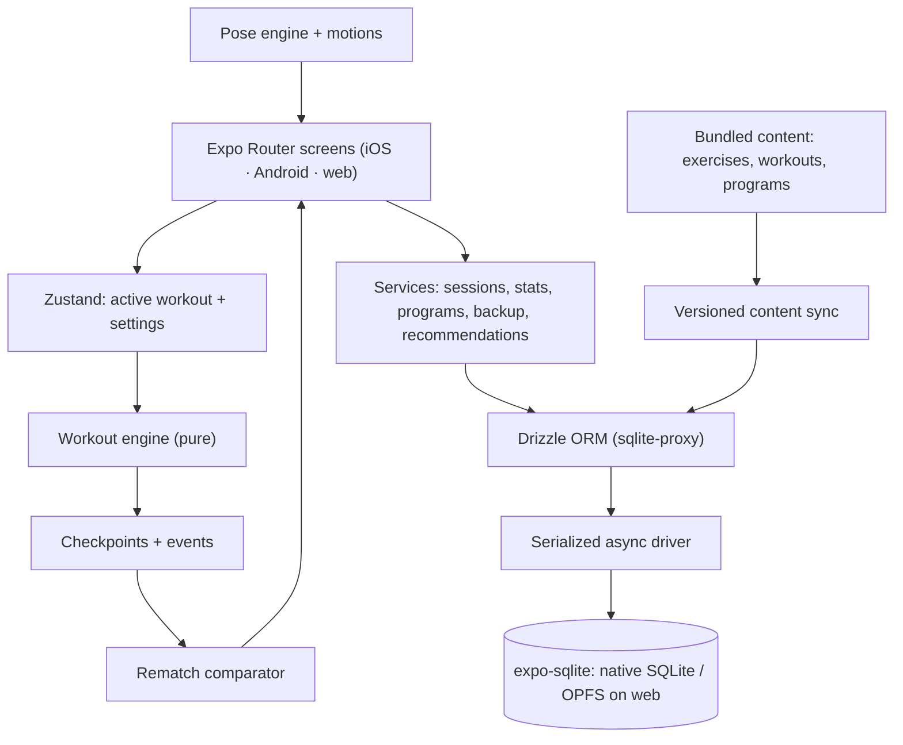

<p align="center">
  
</p>

<p align="center">
  <strong>A benchmark fitness app where your past performance becomes a live opponent.</strong><br/>
  Race real checkpoint telemetry, find where you gained or lost time, and build the next version of yourself.<br/>
  On iOS, Android and the web, fully offline.
</p>

<p align="center">
  
  
  
  
  
  <a href="./LICENSE"></a>
</p>

<p align="center">
  <a href="#the-idea">The idea</a> ·
  <a href="#how-rematch-works">How it works</a> ·
  <a href="#features">Features</a> ·
  <a href="#training-library">Library</a> ·
  <a href="#the-race-engine">Race engine</a> ·
  <a href="#architecture">Architecture</a> ·
  <a href="#quick-start">Quick start</a>
</p>

---

## The idea

Most workout apps record a result.

**REMATCH records a race.**

Every completed benchmark becomes an opponent for the next attempt. Instead of comparing only final times, REMATCH stores a split at every movement and every round, then uses that real telemetry during the next session to show whether you're ahead or behind **where it actually matters**.

> Final time tells you **if** you improved. Checkpoints tell you **where**.

No social leaderboard. No stranger to chase. No account, no server.

**You vs. you.**

<table>
  <tr>
    <td align="center"><strong>58</strong><br/>original benchmarks</td>
    <td align="center"><strong>95</strong><br/>animated exercises</td>
    <td align="center"><strong>6</strong><br/>workout formats</td>
    <td align="center"><strong>6</strong><br/>multi-week programs</td>
    <td align="center"><strong>7</strong><br/>warm-ups &amp; cool-downs</td>
  </tr>
</table>

## How REMATCH works



A previous attempt is never simulated as a smooth, imaginary pace. The race UI only moves on **recorded checkpoint telemetry**.

## Features

| | Feature | What it means in practice |
|---|---|---|
| **↯** | **Real rematch telemetry** | Splits at every movement and round. The live delta compares you at the same checkpoint, and turns against you the moment past-you reaches your next checkpoint first. |
| **◎** | **Any past attempt can race you** | Rematch your PB, your last attempt, or pick any finished attempt. |
| **◆** | **Honest PBs** | PBs are isolated by workout version, size (full, ¾, ½, ¼) and scaling (RX, scaled, modified). Changing a workout creates a new version instead of rewriting history. |
| **⏱** | **Every format runs properly** | For time, chippers, ladders, AMRAP (rounds + reps to the cap), EMOM (rest until the minute), intervals (work/rest, rep counting), time caps and prescribed rest. Timed holds and rests run their own clocks. |
| **⇄** | **Scaling that stays honest** | Swap any movement for its easier variant before you start or mid-workout. The result is filed as scaled or modified automatically. |
| **✦** | **Animated exercise demos** | Every one of the 95 exercises has an original stick-figure animation, with cues, common mistakes, muscles on a body map and easier/harder progressions. |
| **▦** | **Programs** | Six multi-week plans that re-test key benchmarks, so the rematch shows real progress. |
| **✎** | **Build your own** | Create custom benchmarks in any format; they race, version and PB like the built-ins. |
| **▤** | **Progress** | Weekly goal and streaks, an 18-week training calendar, a 30-day muscle map, first → latest → best for every benchmark, trend charts and full history. |
| **♪** | **Workout-native feedback** | Countdown beeps that mix with your music, an optional voice coach, haptics, keep-awake, big touch targets and pause/resume. |
| **⌨** | **Web app** | Responsive layout with a sidebar on wide screens, keyboard shortcuts during workouts, installable as a PWA and usable offline after the first visit. |
| **↺** | **Recovery and backup** | Sessions survive app kills and reloads; export everything as one JSON file and restore it on another device or browser. |
| **⚡** | **Challenge Me** | Pick 5–30 minutes; recommendations respect your level, equipment, recent sessions and reported pain. |

## Training library

**58 original benchmarks**, including TEMPEST, EMBER, RIPTIDE, AVALANCHE, SUMMIT, VORTEX, APEX, NOVA, ONYX, AURORA, SCORCH, INFERNO, MONSOON, OVERHANG, BASALT and PINNACLE, plus **4 warm-ups** and **3 cool-downs**.

| Format | Benchmarks | Scored by |
|---|---|---|
| For time (fixed rounds) | 30 | time |
| Chipper | 6 | time |
| Ladder | 3 | time |
| Intervals (incl. a Tabata) | 10 | total reps |
| AMRAP | 5 | rounds + reps |
| EMOM | 4 | total reps |

- **Equipment-aware:** bodyweight, mat, pull-up bar, dumbbells, kettlebell, bench/box, jump rope and resistance band.
- **Difficulty:** beginner, intermediate, advanced and elite.
- **Sizes:** full, ¾, ½ and ¼ of every workout.
- **Exercises:** 95 movements, from wall push-ups to toes-to-bar and devil presses. Each has easier and harder variants where they exist, plus mobility drills for warm-ups and cool-downs.

**Programs:**

| Program | Length |
|---|---|
| FIRST REMATCH | 3 weeks × 3 sessions |
| ENGINE | 4 weeks × 3 sessions |
| MIDLINE | 3 weeks × 3 sessions |
| LOADED | 4 weeks × 3 sessions (dumbbells) |
| ASCENT | 4 weeks × 3 sessions (pull-up bar) |
| GAUNTLET | 4 weeks × 4 sessions |

Every program opens and closes on the same benchmark.

## The race engine

The workout engine (`src/engine/workoutEngine.ts`) is a pure, deterministic state machine. Every transition takes the elapsed **active** time and returns the next state plus the events it produced. Timed transitions land on their exact boundary, not on the tick that noticed them, so a late tick or a backgrounded phone never stretches an interval.

```text
session
├── version + size + scaling
├── timer (pauses never count)
├── round / movement / reps, rest, EMOM window, time cap
├── checkpoints: r{round}-e{movement}, round-{n}  (+ cumulative reps)
├── event log
└── opponent session
```

Two kinds of race:

- **Pace** (for time, AMRAP): who reached each checkpoint first.
  ```text
  Round 1    you 02:03    past you 02:08    −5.0 sec
  Round 2    you 04:21    past you 04:17    +4.0 sec
  ```
- **Volume** (intervals, EMOM): the clock is fixed, so the race compares reps banked at the same checkpoint.

## Architecture



### Design principles

**Local first.** Nothing between tapping START and finishing a workout depends on a network.

**History must stay honest.** A workout's identity is its exact structure plus how it is scored. Copy and colours can change freely; a structural change creates a new version, and old results keep their own PBs.

**The timer is part of the domain.** Pauses are accumulated explicitly, and every engine transition is computed from active time.

**Async everywhere.** Drizzle runs through its `sqlite-proxy` driver on expo-sqlite's async API. Synchronous expo-sqlite calls busy-wait on the web, so the app never uses them. All statements go through one serialized queue, and transactions hold it.

**Content reaches existing installs.** On every start, bundled content is compared with what's stored. New workouts and exercises are added, metadata is refreshed, and changed workouts get new versions.

## Screens

| Surface | Purpose |
|---|---|
| **Onboarding** | Goal, level, equipment, session length, weekly goal |
| **Today** | Weekly goal ring and streaks, active program session, the daily pick, warm-up/cool-down, recent PBs, resume an unfinished workout |
| **Workouts** | Benchmarks, programs, your custom workouts and warm-ups, with search and filters for format, level, length and equipment |
| **Exercises** | 95 animated demos, filtered by movement, equipment or muscle (with a body map on wide screens) |
| **Workout** | Structure preview, size, per-movement scaling, PB/last/attempts, trend chart, opponent choice |
| **Active** | Countdown, movement demo, rep counter, timed rings, rest, EMOM window, AMRAP cap, live race, pause menu |
| **Result** | Score, comparison, splits (where you won or lost it), PB state, how it felt / pain report |
| **Program** | Schedule, progress, next session |
| **Builder** | Create or edit a custom benchmark |
| **Progress** | Totals, weekly bars against your goal, training calendar, muscle map, benchmark progress, history |
| **Profile** | Training preferences, cues, countdown, week start, backup export/import, erase data |

## Tech stack

| Layer | Technology |
|---|---|
| App | React Native 0.86, React 19, react-native-web |
| Runtime | Expo SDK 57 |
| Navigation | Expo Router (native stack, JS tabs with a sidebar on wide screens) |
| Language | TypeScript 6 |
| State | Zustand |
| Persistence | expo-sqlite (async API), Drizzle ORM via `sqlite-proxy` |
| Graphics | react-native-svg (animations, charts, body map), expo-linear-gradient |
| Feedback | expo-audio, expo-speech, expo-haptics, expo-keep-awake |
| Files | expo-file-system, expo-sharing, expo-document-picker |
| Typography | Bebas Neue + DM Sans |
| Tests | Node test runner via `tsx`, real SQLite through `node:sqlite` |

## Quick start

### 1. Install

```bash
git clone https://github.com/sdziupin/Rematch.git
cd Rematch
npm ci
```

### 2. Run

```bash
npm start        # then press i (iOS), a (Android) or w (web)
npm run web      # straight to the browser
```

### 3. Build and host the web app

```bash
npm run build:web   # static export to dist/
npm run serve:web   # local server with SPA fallback on http://localhost:8080
```

`dist/` is a single-page app that works on any static host. Configure a fallback to `index.html` for unknown routes, and serve it from the domain root (`/sw.js` handles offline caching). The data lives in the browser's origin-private file system. It can be open in one tab at a time: a second tab offers to take over, and windows that block storage (some private modes) get a clear message instead of a broken app.

### 4. Test

```bash
npm test          # 365 tests: engine, race, scoring, stats, DB lifecycle, migrations, backup, content, animations
npm run typecheck
```

### Handy scripts

| Script | What it does |
|---|---|
| `npm run motion-sheet -- out.html --only burpee,pull-up` | Renders exercise animations as a contact sheet for review |
| `npm run generate:sounds` | Re-synthesises the cue sounds in `assets/sounds/` |

## Keyboard shortcuts (web)

| Key | During a workout |
|---|---|
| `Space` / `Enter` | Done → next movement · skip rest · resume |
| `↑` / `+` and `↓` / `−` | Count reps |
| `P` / `Esc` | Pause / resume |

## Project structure

```text
Rematch/
├── app/                      # Expo Router screens
│   ├── (tabs)/               # Today, Workouts, Exercises, Progress, Profile
│   ├── workout/              # Detail, active, recovery, result
│   ├── exercise/ program/    # Exercise and program pages
│   ├── opponent/             # Opponent picker
│   └── builder.tsx           # Custom workout builder
├── src/
│   ├── animation/            # Skeleton/pose solver and motions for every exercise
│   ├── components/           # UI kit, charts, body map, race UI, dialogs
│   ├── content/              # Exercises, workouts, programs (+ validation tests)
│   ├── db/                   # Schema, migrations, async driver, content sync
│   ├── domain/               # Timer, rematch comparator, scoring, stats, scaling
│   ├── engine/               # Deterministic workout state machine
│   ├── services/             # Sessions, stats, programs, backup, cues, recommendations
│   ├── store/                # Zustand stores
│   └── theme/                # Design tokens
├── public/                   # Web shell: manifest, icons, service worker
├── assets/                   # App icons, generated artwork, cue sounds
├── design/                   # Brand, copy, content and handoff specs
└── scripts/                  # Web server, motion sheet, sound and asset generators
```

## Visual language

REMATCH is dark, focused and competitive without being aggressive.

| Role | Token |
|---|---|
| Canvas | `#0A0C10` |
| Surface | `#141820` |
| Elevated | `#1C2230` |
| Primary text | `#E8ECF4` |
| **Ahead / CTA** | `#4ECDC4` |
| **Behind / challenge** | `#F4A261` |
| **PB / success** | `#6BCB77` |
| **Rest** | `#5B8DEF` |

**Bebas Neue** carries workout names, timers and big numbers. **DM Sans** handles the interface.

## Invariants

These rules are enforced by tests:

- Paused time never leaks into active elapsed time.
- Timed steps, rests and EMOM windows end on their exact boundaries.
- Race comparison uses checkpoint telemetry, ordered by position in the workout.
- RX and scaled results never share a PB, and a session can only move down the scaling ladder.
- Abandoned or time-capped attempts never set a PB; deleting a PB promotes the next best.
- An existing install upgrades in place without losing PBs.
- A backup restores onto any install, even one that numbered workout versions differently.
- The 31 original workout structures never change (snapshot test).

## Acknowledgements

Several feature ideas (exercise library with demos, body map, programs, rest timer, heatmap, backup export, keyboard-driven web UI) were inspired by [openGym](https://github.com/DuarteSantos8/openGym). No code, data or media was copied: REMATCH's animations, sounds, content and code are original and MIT-licensed.

## License

Licensed under the [MIT License](./LICENSE).

---

<p align="center">
  <strong>REMATCH</strong><br/>
  <sub>Your best competition already knows all your excuses.</sub>
</p>
